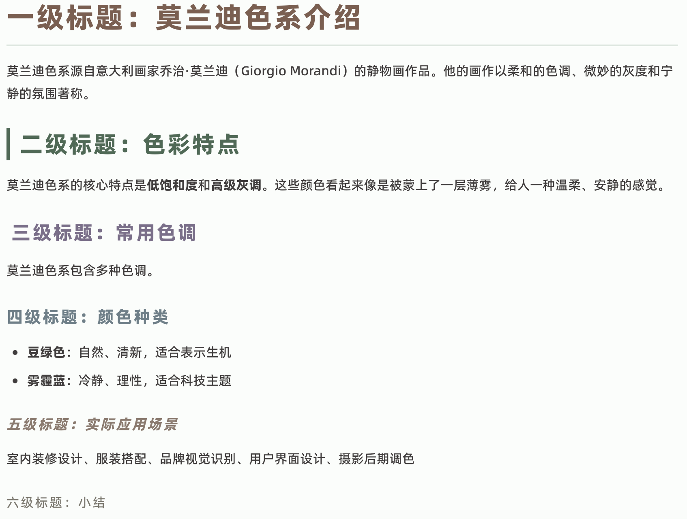
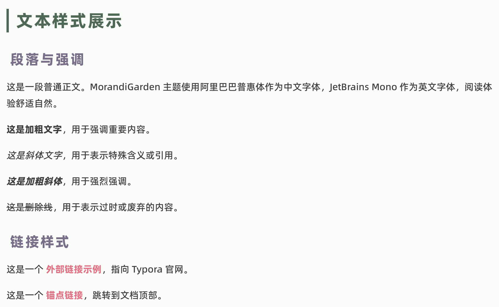
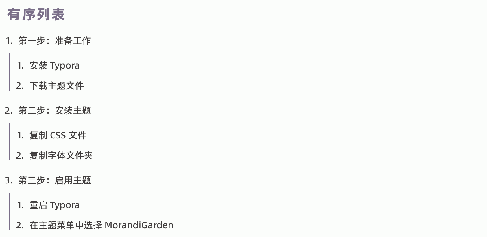
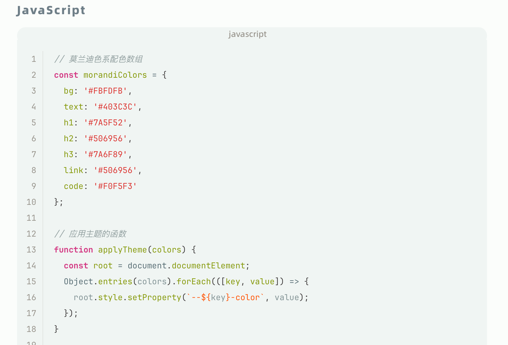
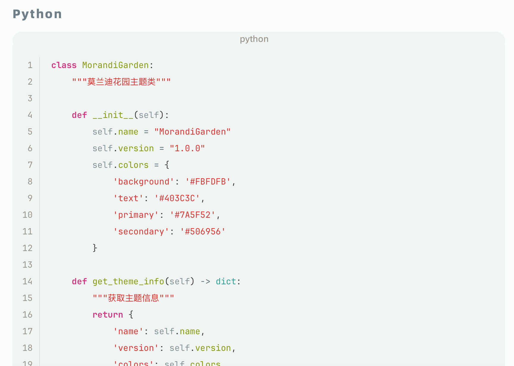
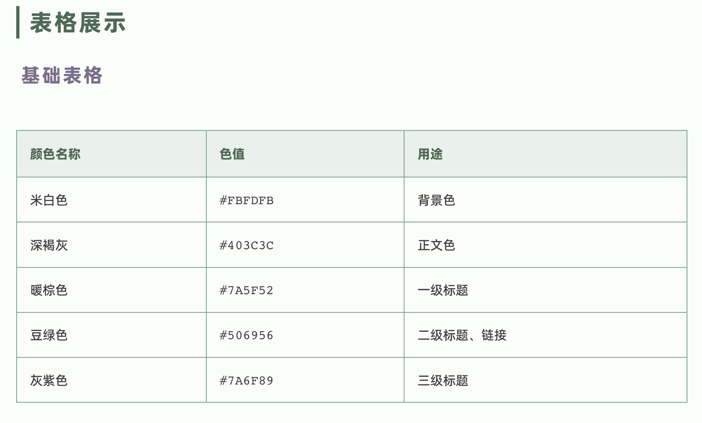
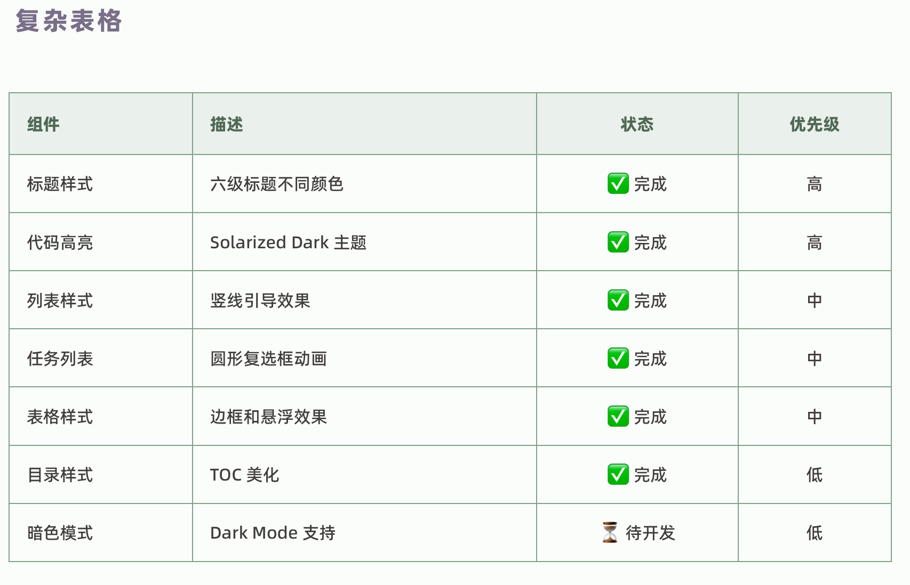
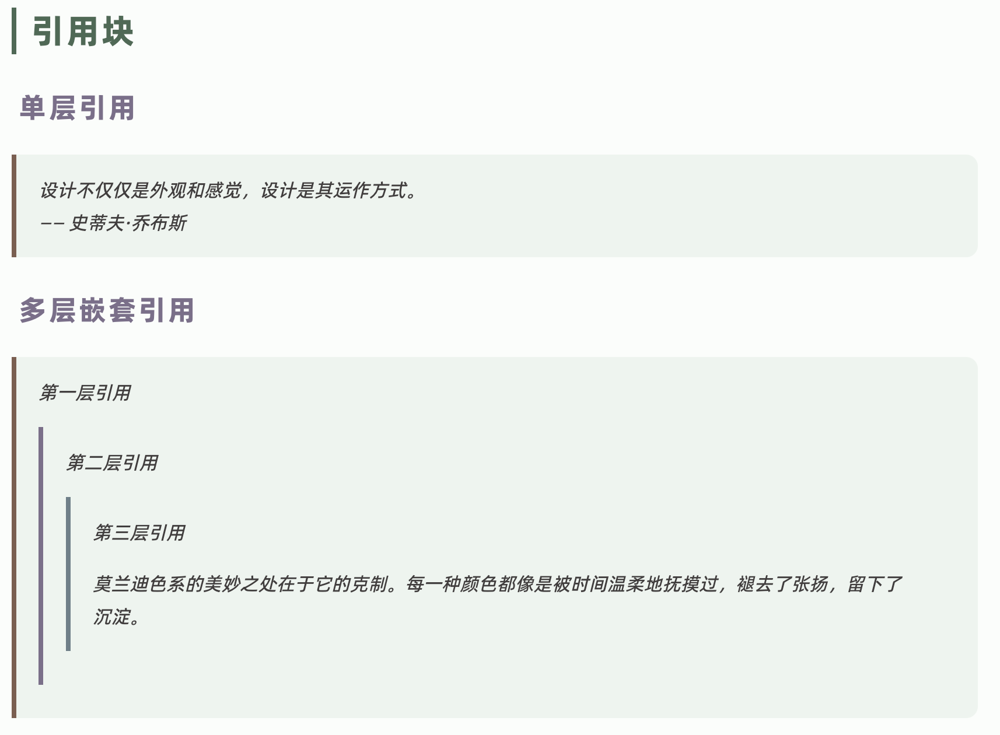
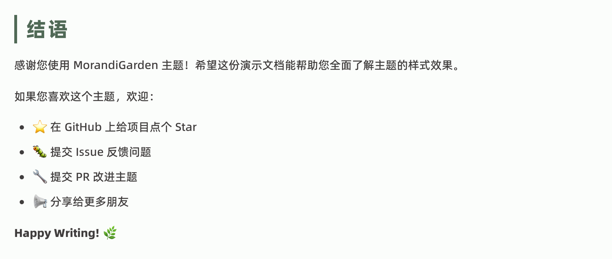

# MorandiGarden

一个为 [Typora](https://typora.io/) 编辑器设计的莫兰迪色系主题，灵感源自意大利画家乔治·莫兰迪（Giorgio Morandi）的静物画配色——柔和、优雅、克制。

## 特点

- **莫兰迪配色**：采用低饱和度的自然色调，长时间写作不易疲劳
- **中文优化**：使用阿里巴巴普惠体作为中文字体，阅读体验舒适
- **代码高亮**：基于 Solarized Dark 的语法高亮，清晰区分各类代码元素
- **精致细节**：
  - 六级标题采用不同颜色，层次分明
  - 列表带有竖线引导，结构清晰
  - 任务列表使用圆形复选框，选中时有平滑动画
  - 引用块带有渐变边框和圆角
  - 目录（TOC）样式美化，带悬浮效果

## 安装

### 方式一：手动安装

1. 下载本仓库的 ZIP 文件并解压
2. 打开 Typora，进入 **偏好设置 → 外观 → 打开主题文件夹**
3. 将以下文件复制到主题文件夹：
   - `morandigarden.css`
   - `morandigarden/` 文件夹（包含字体文件）
4. 重启 Typora
5. 在 **主题** 菜单中选择 **MorandiGarden**

### 方式二：Git Clone

```bash
# 进入 Typora 主题目录（macOS 示例）
cd ~/Library/Application Support/abnerworks.Typora/themes

# 克隆仓库
git clone https://github.com/yourusername/MorandiGarden.git

# 复制主题文件到主题目录
cp MorandiGarden/morandigarden.css ./
cp -r MorandiGarden/morandigarden ./
```

## 字体说明

本主题内置以下字体文件：

| 字体 | 用途 | 来源 |
|------|------|------|
| Alibaba PuHuiTi 3.0 | 中文正文 | [阿里巴巴普惠体](https://fonts.alibabadesign.com/) |
| JetBrains Mono NL | 英文及代码 | [JetBrains](https://www.jetbrains.com/lp/mono/) |

字体文件已包含在 `morandigarden/` 文件夹中，无需额外安装。

## 配色方案

### 背景与文字
- 背景色：`#FBFDFB`（米白色）
- 正文色：`#403C3C`（深褐灰）

### 标题层级
| 层级 | 颜色 | 色值 |
|------|------|------|
| H1 | 暖棕色 | `#7A5F52` |
| H2 | 豆绿色 | `#506956` |
| H3 | 灰紫色 | `#7A6F89` |
| H4 | 青灰色 | `#6F7F88` |
| H5 | 浅褐色 | `#8A7A6F` |
| H6 | 暖灰色 | `#7D7A71` |

### 强调色
- 链接：`#506956`（豆绿）
- 代码背景：`#F0F5F3`（浅青绿）
- 引用边框：`#7A5F52`（暖棕）
- 表格边框：`#7ea388`（浅豆绿）

## 兼容性

- **Typora 版本**：1.0 及以上
- **操作系统**：macOS、Windows、Linux
- **导出格式**：支持导出为 PDF、HTML、Word 等格式

## 截图

### 分级标题



### 文本样式



### 列表




### 代码块





### 表格





### 引用块



### 结语



## 自定义

如需调整主题，可编辑 `morandigarden.css` 文件中的 CSS 变量：

```css
:root {
  --bg-color: #FBFDFB;        /* 修改背景色 */
  --text-color: #403C3C;      /* 修改文字色 */
  --h1-color: #7A5F52;        /* 修改 H1 颜色 */
  --write-width: 860px;       /* 修改编辑区宽度 */
  --font-size-base: 16px;     /* 修改基础字号 */
}
```

## 更新日志

### v1.0.0 (2025-04-10)
- 初始版本发布
- 完成基础样式设计
- 实现代码高亮、列表、表格、任务列表等组件
- 添加目录（TOC）美化

## 致谢

- [Typora](https://typora.io/) - 优秀的 Markdown 编辑器
- [阿里巴巴普惠体](https://fonts.alibabadesign.com/) - 免费商用中文字体
- [JetBrains Mono](https://www.jetbrains.com/lp/mono/) - 优秀的编程字体
- 乔治·莫兰迪 - 色彩灵感来源

## 许可

本项目采用 [MIT License](./LICENSE) 开源许可。

字体文件遵循各自的原许可协议：
- 阿里巴巴普惠体：SIL Open Font License 1.1
- JetBrains Mono：SIL Open Font License 1.1

---

**Enjoy writing with MorandiGarden!** 🌿
